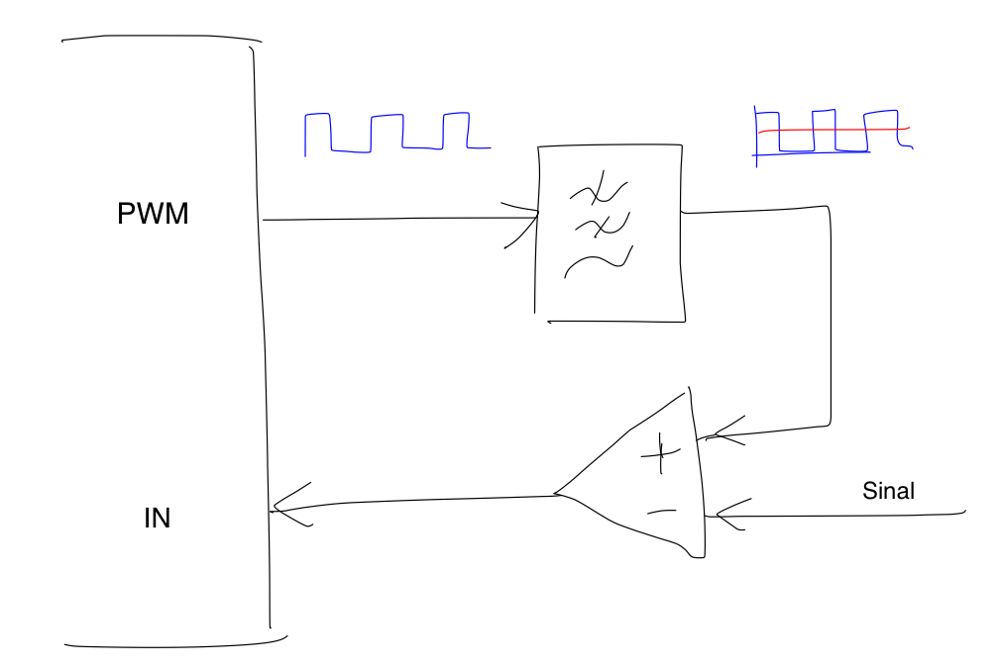
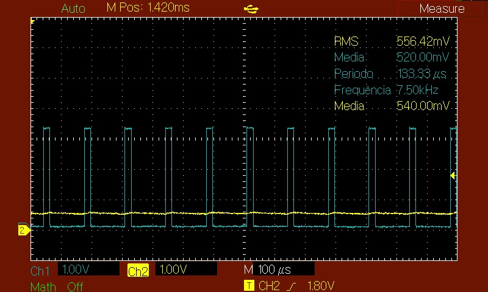
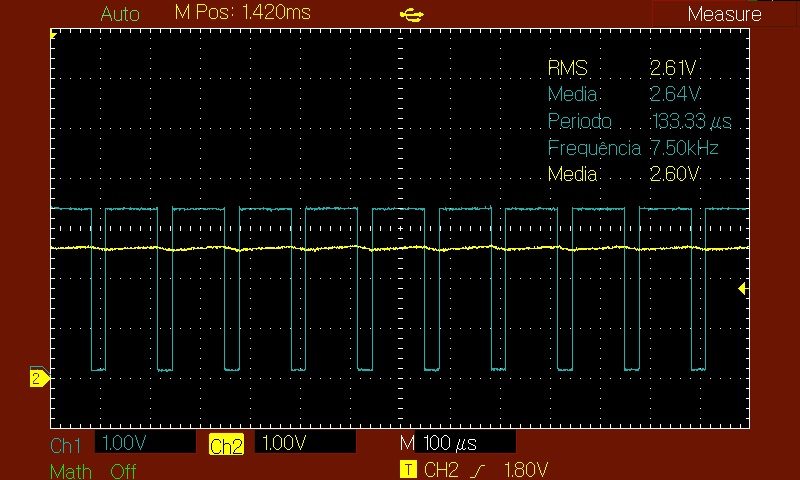
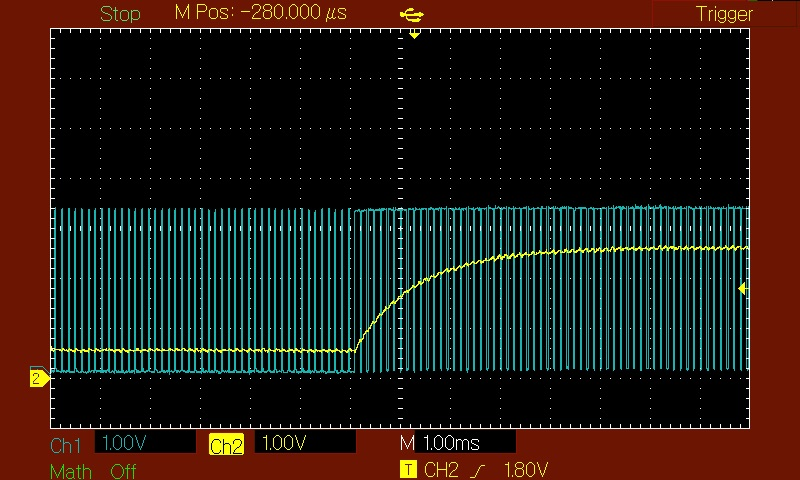
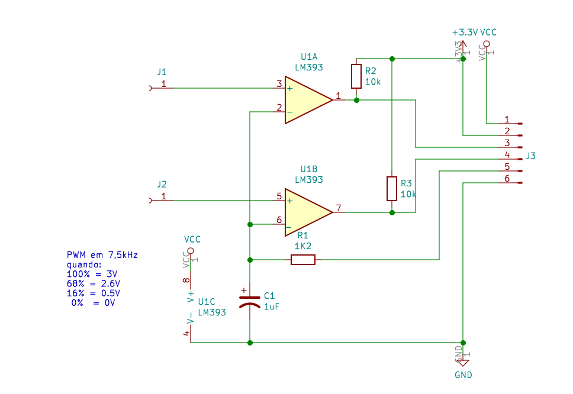
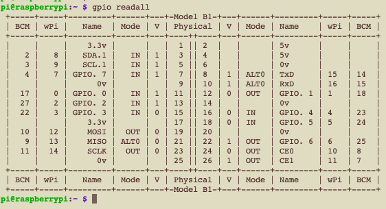

# Raspberry Pi e conversor Analógico Digital


Brasília 02 de agosto de 2020

Este trabalho apresenta um conversor analógico digital muito simples que implementei num Raspberry Pi. Eu precisava monitorar a tensão de alimentação de um sistema baseado num Raspberry Pi de uma maneira rápido e simples e  eu não queria envolver circuitos integrados dedicados a essa tarefa. Partia do principio que todos os recursos para fazer essa monitoração já estavam presentes no Raspberry e era só uma questão de usar os recursos já disponíveis.


Pois bem. Os requisitos do meus sistema eram medir uma tensão em intervalor regulares de um segundo. Ou seja, o tempo de processamento da amostragem até processamento da tensão não eram críticos e podiam ser feitos com qualquer hardware ou software disponível no Raspberry. 

# 1. Conversor analógico digital 
Um conversor analógico digital (CAD) pode ser implementado de várias maneiras. Em sistemas onde o tempo de processamento tem que ser muito rápido, pode-se usar sistemas digitais baseado em comparadores que codificam a tensão analógica de forma instantánea. O preço que se paga pela rapidez é na quantidade de comparadores que se precisa usar e a complexidade de sua implementação. 
Entretanto, a grande maioria dos conversores usam um sistema muito mais simples que são compostos por um conversor digital analógico (CDA), um comparador analógico e um algoritmo de conversão implementado em software ou hardware. 
Dependendo da aplicação a gente escolha o tempo de conversão, a resolução do conversor e o algoritmo de conversão. 

Neste nosso caso específico, vamos usar todos estes recursos já disponíveis no Raspberry Pi. O único componente externo vai ser o comparador analógico.

## 1.1. Algoritmo de conversão
O algoritmo que implemente a conversão analógico digital funciona da seguinte forma. O computador gera por meio do conversor digital analógico (CDA) um sinal analógico e compara este valor ao sinal que se pretende medir por meio de um comparador analógico. A maneira mais simples de fazer isso é iniciar o CDA com o valor zero e vai incrementando o valor até que o comparador avisa que o valor gerada é maior que o valor sendo comparado. 
Obviamente, este algoritmo pode levar algum tempo, pois depende do valor do sinal a ser medido e a quantidade de bits. 
Por exemplo, se o valor medido está no fim da escala, e o conversor trabalha com 8 bits, o tempo para fazer este processamento vai ser em torno de 255 vezes o tempo de fazer a conversão digital analógico.
A disvantagem é que este tempo também muda em função do valor a ser medido.
 
Estistem algoritmos mais eficazes que fazer a conversão num periodo muito mais curto. O algoritmo de aproximações sucessivos consegue medir o valor numa quantidade fixa de interações que é igual a quantidade de bits do CDA.

Neste exemplo vamos usar o algoritmo de aproximação sucessiva com uma resolução de oito bits.

## 1.2. Conversor digital analógico
O Raspberry Pi tem diversos pinos de entrada e saída. Estes GPIO (pinos de entrada e saída gerias) podem ser usados para interfacear com diversos circuitos externos. Alguns desses pinos podem ser configurados para implementar uma técnica muito simples de conversão digital analógica usando modulação por largura de pulsos ou Pulse Widht Modulation PWM.
O PWM pode ser implementado por software ou pelo próprio hardware do Raspberry Pi. No nosso caso optamos em usar o PWM gerado pelo hardware do Raspberry Pi. O PWM por software tem uma limitação de 10 Hz, enquanto o PWM por hardware pode gerar sinais na ordem de algumas decenas de khz. 

O uso de harware PWM está limitado somente a quatro pinos do Raspberry Pi (GPIO12, GPIO13, GPIO18 e GPIO19).

O diagrama de blocos a seguir apresenta o processo de conversão tendo um PWM gerando um sinal digital que depois é filtrado por um filtro passabaixa que transforme o sinal digital modulado no seu correspodente analógica, que é comparado com o sinal a ser medido. 



## 1.3. Filtro passa baixa

Há um compromisso entre a efetividade do filtro e o tempo de acomodação do filtro em resposta a uma mudança na sua entrada. 
O filtro é implementado com um circuito RC simples. A frequencia de corte é 1/(2 pi R C). O tempo de acomodação do filtro é dado pelo produto R C. 

O valor muito grande do produto RC garante uma melhor filtragem, mas em contrapartida leva a um tempo de acomodação maior. Do outro lado também tem os condicionantes da própria capacidade de acionamento dos pinos de saida do Raspberry. 

As figuras a seguir mostram o funcionamento do filtro com um capacitor de 1 micro farad e um resistor de 1,2 kOhms. A frequencia de corte de 132 Hz garante uma a obtenção da valor rms com boa precisão. Pode-se ver que o ruído do filtro fica menor que 0.2 volts. 

A primeira figura mostra a resposta do filtro ao sinal de PWM de 16%  (40/256).

O valor médio na teoria seria 16% de 3.3v = 0,528v



A segunda figura mostra a resposta do filtro ao sinal de PWM de 78%  (200/255).

O valor médio teoricamente é de 2.54v.



A terceira figura mostra o tempo de acomodação quando a entrada do filtro muda de 16% para 78%.

Pode-se opbservar que o tempo de acomodação é no mínimo 5 milisegundos





# 2. Implementação do hardware


## 2.1. Circuito implementado
A implementação do circuito foi realizado com um comparador LM393 que contem dois comparador com saída em coletor aberto.
Dessa forma foi possível implementar dois circuitos.

| adc | pino | raspberry | pino raspberry | funcao |
|:---:|:----:|:----:|:----:|:------:|
| Vcc |  1   | Vcc  |   2  | 5 volts|
|3.3v |  2   | 3.3v |   1  | 3.3 volts |
| S1  |  3   |GPIO.2|  13  | entrada comparador 1|
| S2  |  4   |GPIO.3|  15  | entrada comparador 2|
| pwm |  5   |GPIO.1|  12  | saída  pwm 
| gnd |  6   | gnd  |   6  | terra |




## 2.2. Configuração do PWM

Tem várias maneiras configurar o GPIO e permtir os acessos a estes pinos no Raspberry Pi.

Os pinos podem ser acessados diretamente a partir de entradas no sistema de arquivos do linux. Os pinos físicos são exportados como arquivos de entrada e saída, que podem ser facilmente acessados por programas em qualquer linguagem de programação. A operação de manipulação dos GPIO usa a mesma estrutura de entrada a arquivos do linux.

Também há bibliotecas específicas para linguagem C, Python e outras linguagens que permitem o acesso ao hardware, com mais ou menos limitações. 

No nosso caso vamos usar um misto de ferramentas para configurar o GPIO com as ferramentas consolidados do Raspberry e linguagem C para acessar o sistema de arquivos. 

### 2.3.1. configuração do GPIO 

O utilitário ```gpio``` que já vem com o Raspberry Pi pode ser util para preparar o hardware.
O comando 

```gpio readall``` executado no terminal do linux mostra a seguinte tela.



Há uma confusão na numeração dos pinos de GPIO do Raspberry. Tem a numeração física dos pinos, neste caso num Raspberry Pi a versão xxx que tem um conector de 28 pinos. 

O PWM nesta versão do Raspberry é implementado no GPIO.1 que corresponde a BCM.18 do BCM ou pino fisico 12.
O comandos para configurar o PWM por meio do utilitário ```gpio``` são: 

```
$ gpio mode 1 pwm   // configura GPIO.1 ou BCM-18 como pwm ou função alternativa alt 5
$ gpio pwm-ms       // configura o pwm para mark-space
$ gpio pwmc 100     // configura a frequencia do pwm (750hz)
$ gpio pwmr 256     // configura o ratio, neste caso para uma resolução de 8 bits
```


Essa configuração também pode ser executado a partir de um programa em linguagem C a partir de ```system call```
conforme o exemplo a seguir.

```
#include <stdlib.h>
#include <string.h>  
#include <stdio.h>

void setup_pwm(void)
{
  /* faca o setup do ADC com system call do gpio */  
  char command[50];
  strcpy(command,"gpio mode 1 pwm");
  system(command);           // configura pwm 
  system("gpio pwm-ms");
  system("gpio pwmc 100");   // 750hz
  system("gpio pwmr 256");   // conversor 8 bits
  system("gpio pwm 1 0");    // escreve 0 no pwm 
}
```

### 2.3.2. Mapeamento dos pinos no sistema de arquivos

O acesso aos pinos de entrada é por meio de mapeamento destes pinos em arquivos no linux.

```
FILE *f2;
FILE *f3;
void mapea_pinos(void)
{
 system("gpio export 27 in"); // exporta GPIO.2 para /sys/class/gpio/gpio27/value  
 system("gpio export 22 in"); // exporta GPIO.3 para /sys/class/gpio/gpio22/value
} 
```

Com isso pode ser ter acesso ao pinos por meio de simples leitura de arquivos.

O trecho do programa a seguir mostra a leitura dos pinos.

```
int leia_gpio(int i)
{
 int x;
 if (i==2) {f2=fopen("/sys/class/gpio/gpio27/value","r"); fscanf(f2, "%c", &c); fclose(f2);}
 if (i==3) {f3=fopen("/sys/class/gpio/gpio22/value","r"); fscanf(f3, "%c", &c); fclose(f3);}
 return(c-'0')
}
```


A leitura dos pinos nessa configuração é um pouco demorada. O tempo estimado para abrir o arquivo, fazer a leitura e fechar o arquivo é de aproximadamente 25 milisegundos no Raspberry.

Este tempo é 5 vezes e meio mais lento que o tempo de acomodação do filtro do pwm que é de 5 no mínimo 5 milisegundos.

Fizemos o teste com uma biblioteca específica do Raspberry que permite acesso direto ao pinos para comparar o tempo de processamento.  
Usamos as funções do wiringPi, mas o tempo de processamento não mudou muito. O tempo total de acessar o PWM e ler o dado foi de 32 milisegundos. Ou seja, não trouxe nenhuma vantagem expressiva de usar a biblioteca específica de acesso ao sistema. 

Além disso, o uso dessa biblioteca, junto com as chamadas ao sistema poderia dar um problemas não previstas. Por isso optamos usar somente as chamadas ao sistema e leitura de arquivo, técnica já bastante consolidadas no linux.

	
O trecho a seguir mostra a função para escrever escever no PWM do conversor digital analógico.


```
void escreve_pwm(int i)
{ 
 char[20] str1,str2;
 strcpy(str1, "gpio pwm 1 ");
 sprintf(str2,"%d",i); 
 strcat(str1,str2);
 system(str1);  
}
```


# 3. Algoritmo de aproximação sucessiva

O algoritmo de aproximação sucessiva usado usa um tempo de acomodação do filtro de 10 milisegundos, implementado pela função usleep.

```
int leia_adc(int num_gpio) 
{
 int i=0;
 int valor=0;
 int dummy=0x80;
 while (i<8)
 { 
   escreve_pwm(dummy+valor);
   usleep(10000);  // espera filtrar e estabilizar 10 milisegundos
   if(leia_gpio(numg_pio)==1) {valor = valor + dummy;}
   i++;
   dummy=dummy >> 1;
 } 
 return(valor); 
}
```

O algoritmo de conversão durou 280 milisegundos medido com o osciloscópio (8 x 35ms)

Essa conversão pode demorar dependendo do carga do CPU. O menor tempo conseguido foi de 260ms. Com o display LCD sendo processado em background o tempo completo chega até meio segundo. Concluimos que o tempo crítico é a rotina de abrir ler e fechar o arquivo que mapea os pinos de entrada.

Mesmo assim o processo ficou dentro da especificação inicial da proposta e atende aos requisitos de fazer o processamento em um (1) segundo. 


